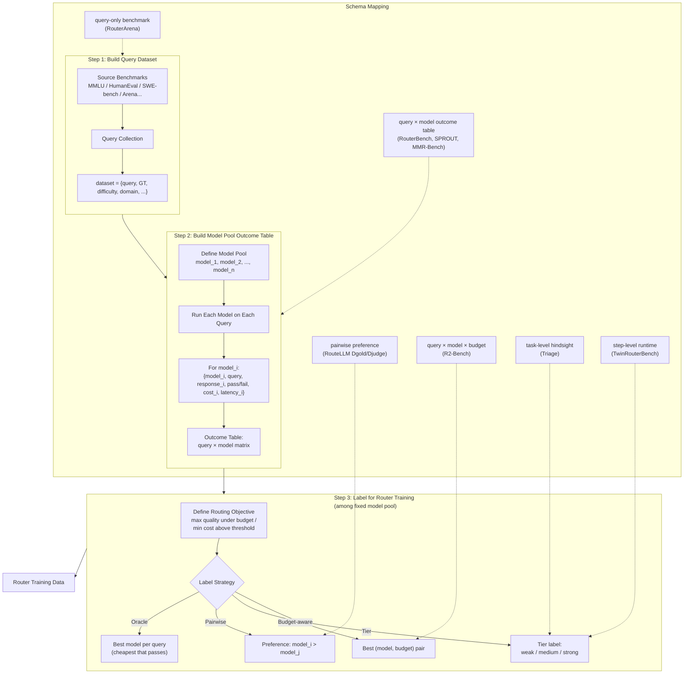

# Router / Agentic Router 数据集统一字段对照

这份文档只做一件事：
把仓库里已经出现的 dataset / benchmark / label asset 按“样本粒度与字段结构”统一对照，避免以后继续把它们都统称成“数据集”。

它主要回答四个问题：
1. 每个资产的样本主键粒度到底是什么：query、query×model、query×model×budget、task，还是 step？
2. 它显式包含哪些核心字段？
3. 它更像 evaluator、training asset，还是 label protocol？
4. 如果以后新加一篇 paper，应该往哪一类 schema 里归？

---

## 1. 最短结论

当前仓库里的数据资产，按字段结构看，基本分成 6 类：

1. `query-only benchmark schema`
   - 代表：RouterArena
   - 样本主体是 query 本身
   - 强项是 domain / category / difficulty / benchmark organization
   - 适合 evaluator，不直接等于 router supervision

2. `query × model outcome-table schema`
   - 代表：RouterBench、SPROUT、MMR-Bench
   - 一个 query 对多个模型有并列 outcome
   - 强项是 per-model response / score / cost
   - 最适合训练 multi-model router

3. `query × model × budget curve schema`
   - 代表：R2-Bench
   - 比 outcome table 多一维 budget
   - 最适合训练 model+budget 联合 router

4. `pairwise preference schema`
   - 代表：Arena preference、Dgold、Djudge
   - 标签是偏好、胜负或 judge 结果，而不是完整 outcome table
   - 最适合 RouteLLM 一类 binary / pairwise router

5. `task-level hindsight tier schema`
   - 代表：Triage hindsight labels
   - 样本不是 query，而是 issue / task
   - 标签是 cheapest sufficient tier
   - 最适合 pre-run prior

6. `step-level runtime routing schema`
   - 代表：TwinRouterBench
   - 样本不是完整任务，而是轨迹中的一个 step prefix
   - 标签是 target tier
   - 最适合 coding-agent execution-time router

一句话总结：
- General Router 最核心的训练数据是 `query × model` 或 `query × model × budget`
- Coding-Agentic Router 最核心的训练数据是 `task-level` 和 `step-level hindsight label`
- RouterArena / SWE-bench 这类 benchmark 更像验收底座，不等于训练 supervision 本身

---

## 2. 一张表看当前仓库里的主要 schema 家族

| schema 家族 | 代表资产 | 样本粒度 | 核心字段形态 | 主要用途 |
|---|---|---|---|---|
| query-only benchmark | RouterArena | query | query + category/domain/difficulty + answer | evaluator / leaderboard |
| query × model outcome table | RouterBench, SPROUT, MMR-Bench | query × model | prompt/query + model_id + response + score/performance + cost/token | multi-model router training / offline eval |
| query × model × budget curve | R2-Bench | query × model × budget | query + model_id + budget + response + quality + token usage | model+budget router |
| pairwise preference | Arena preference, Dgold, Djudge | query 或 query × model-pair | query + preference / judge / winner | binary router / preference learning |
| task-level hindsight tier | Triage | task / issue | repo/task metadata + tier label | pre-run prior |
| step-level runtime routing | TwinRouterBench | step / prefix | messages/prefix + step metadata + target_tier | execution-time router |

---

## 3. 逐个资产看字段

### 3.1 RouterArena

来源：
- `papers/general-single-turn-benchmark-2510.00202-routerarena.md`
- 本地已下载数据集 `RouteWorks/RouterArena`

当前公开 query 表中已看到的字段：
- `Category`
- `Domain`
- `Dataset name`
- `Global Index`
- `Context`
- `Question`
- `Options`
- `Answer`
- `Metadata`
- `Keywords`
- `Difficulty`

单篇笔记里还明确提到平台评测侧会围绕这些 query 再计算：
- benchmark 正确性标签
- 各 router 的 model selection
- accuracy
- cost
- optimality
- robustness
- latency

字段结构理解：
- query 级主键：`Global Index`
- query 内容：`Context`, `Question`, `Options`
- taxonomy：`Category`, `Domain`, `Dataset name`
- supervision：`Answer`
- 难度：`Difficulty`
- 附加信息：`Metadata`, `Keywords`

本质归类：
- `query-only benchmark schema`

优点：
- query taxonomy 最清晰
- 很适合做 benchmark coverage、难度分析、evaluator 构建

局限：
- 当前公开 query 表不直接给 per-model outcome table
- 不直接给 router 训练标签
- 更像 benchmark base table，不像训练 supervision table

---

### 3.2 RouterBench

来源：
- `papers/general-single-turn-benchmark-2403.12031-routerbench.md`

笔记里明确写到每条样本至少包含：
- `sample id`
- `model name`
- `eval name`
- `prompt`
- `model response`
- `performance`
- `cost`
- `true label`

字段结构理解：
- query 主键：`sample id`
- query 内容：`prompt`
- 模型维：`model name`
- 任务维：`eval name`
- 模型输出：`model response`
- 结果标签：`performance`, `true label`
- 成本：`cost`

本质归类：
- `query × model outcome-table schema`

优点：
- outcome table 很标准
- evaluator 与训练接口都清楚
- 离线 router 复现实验最稳定

局限：
- query taxonomy 字段不丰富
- 没有 budget 维
- 更像 benchmark-first outcome table

---

### 3.3 SPROUT

来源：
- `papers/general-single-turn-method-2502.03261-carrot.md`
- `papers/COMPARISON.md`
- `datasets-and-benchmarks-overview.md`

笔记里明确给出的 query 级字段：
- `key`
- `dataset`
- `dataset level`
- `dataset idx`
- `prompt`
- `golden answer`

每个模型对应字段：
- `num input tokens`
- `num output tokens`
- `response`
- `score`

字段结构理解：
- query 主键：`key`
- query 内容：`prompt`
- benchmark 来源：`dataset`, `dataset level`, `dataset idx`
- gold label：`golden answer`
- per-model outcome：`response`, `score`
- 成本相关：`num input tokens`, `num output tokens`

本质归类：
- `query × model outcome-table schema`

优点：
- 比 RouterBench 更训练友好
- 已经把 prompt / gold / per-model response / token / score 打包好
- 最适合多模型 predictor / risk router

局限：
- judge 评分仍可能引入偏差
- 不是 runtime / trajectory 级数据

---

### 3.4 R2-Bench

来源：
- `papers/general-single-turn-method-2602.02823-r2-router.md`
- `papers/COMPARISON.md`

笔记里明确给出的字段：
- query 文本
- 候选模型 ID
- token budget
- judge 质量分（0–1）
- 实际 token 使用量

并强调样本形式是：
- 一个 query 对应多个 `(model, budget, response)` 实例

字段结构理解：
- query：`query`
- 模型维：`model_id`
- 预算维：`token_budget`
- 模型输出：`response`
- 质量监督：`judge_score`
- 资源消耗：`actual_token_usage`

本质归类：
- `query × model × budget curve schema`

优点：
- 比普通 router 数据多了一维 budget
- 是从 model routing 走向 budget routing 的关键桥梁

局限：
- 构造成本高
- 新模型接入代价更高
- 仍是 query-level，不是 runtime agent-level

---

### 3.5 Arena preference / Dgold / Djudge

来源：
- `papers/general-single-turn-method-2406.18665-routellm.md`
- `papers/COMPARISON.md`
- `datasets-and-benchmarks-overview.md`

当前仓库里已明确的信息：
- Arena preference：约 `80k` 人类偏好数据
- Dgold：约 `1500`，gold label 增强数据
- Djudge：约 `120k`，GPT-4 judge 偏好数据

虽然仓库暂未把最终字段展开成完整表，但按笔记内容，它们本质上是：
- query
- 模型对 / strong-vs-weak 设定
- preference / win label / judge label
- 可能附带 benchmark 来源信息

本质归类：
- `pairwise preference schema`

优点：
- 最适合 binary router
- 对 strong-vs-weak 路由最直接

局限：
- 不是 full outcome table
- 不适合直接扩成大 candidate pool 多模型 router

---

### 3.6 Triage hindsight labels

来源：
- `papers/coding-agentic-single-turn-method-2604.07494-triage.md`
- `coding-agent-datasets-comparison.md`
- `datasets-and-benchmarks-overview.md`
- `papers/AGENTIC_COMPARISON.md`

当前仓库里明确的信息：
- 300 tasks
- 3 tiers
- 每 task × tier 跑 3 次
- 总 2700 runs

输入信号在对比文档里被描述为：
- issue 描述
- repo health / code-health
- 测试覆盖率
- 任务元数据

输出标签：
- cheapest sufficient tier

字段结构理解：
- task / issue 主键：task-level
- 输入侧：issue + repo 静态特征 + target-file/coverage/meta 特征
- 标签侧：tier

本质归类：
- `task-level hindsight tier schema`

优点：
- 很适合做 pre-run prior
- 适合和你现在的 repo-level static signals 对接

局限：
- 不是 step-level
- 不覆盖 runtime 中途切换与恢复

---

### 3.7 TwinRouterBench

来源：
- `papers/coding-agentic-multi-turn-benchmark-2605.18859-twinrouterbench.md`
- `coding-agent-datasets-comparison.md`
- `datasets-and-benchmarks-overview.md`
- `papers/AGENTIC_COMPARISON.md`

笔记里明确给出的字段：
- `id`
- `benchmark`
- `instance_id`
- `step_index`
- `total_steps`
- `messages`
- `target_tier`
- `target_tier_id`

并明确说明：
- 公共 JSONL 不暴露 vendor model id，只暴露 tier

字段结构理解：
- trajectory / row 主键：`id`
- benchmark 来源：`benchmark`, `instance_id`
- step 位置：`step_index`, `total_steps`
- runtime state：`messages`
- 标签：`target_tier`, `target_tier_id`

本质归类：
- `step-level runtime routing schema`

优点：
- 最接近 execution-time router
- `messages` 就是 router 真正可见的 prefix state
- tier label 很适合作监督学习

局限：
- 不公开 vendor model id
- 强绑定固定 tier / pool / pricing 语义
- pool 变化后标签可能需要重释义或重标

---

### 3.8 MMR-Bench

来源：
- `papers/multimodal-single-turn-benchmark-2601.17814-mmr-bench.md`
- `papers/COMPARISON.md`
- `datasets-and-benchmarks-overview.md`

笔记里明确提到包含：
- multimodal query
- 每个候选模型的输出
- 每个模型对应的 utility score
- 统一价格模型下的 normalized cost
- frozen split
- deterministic scorer

字段结构理解：
- query：multimodal query
- 模型维：candidate model
- 模型输出：per-model output
- 质量：utility score
- 成本：normalized cost
- 额外：模态相关 embedding / fusion 信息用于 router

本质归类：
- `query × model outcome-table schema`
- 只是它是 multimodal 版，而不是 text-only 版

优点：
- 把模态信号引入 router 输入
- 给未来 screenshot / GUI / diagram-aware routing 很强启发

局限：
- 仍是 query-level
- 不是 agent runtime benchmark

---

## 4. 按 schema 家族做并排字段对照

### 4.1 Query-only benchmark schema

代表：RouterArena

典型字段：
- `query_id`
- `dataset`
- `domain`
- `category`
- `context`
- `question`
- `options`
- `answer`
- `difficulty`
- `metadata`

适合：
- evaluator
- taxonomy / domain coverage 分析
- query 分层与 benchmark 构建

不适合直接当：
- 多模型 router 监督表
- step-level routing 表

---

### 4.2 Query × model outcome-table schema

代表：RouterBench、SPROUT、MMR-Bench

典型字段：
- `query_id`
- `dataset`
- `prompt/query`
- `model_id`
- `response`
- `score/performance`
- `cost`
- `input_tokens`
- `output_tokens`
- `gold_answer/true_label`

适合：
- general router 训练
- cost-quality predictor
- offline router benchmark

不适合直接当：
- step-level runtime router 数据
- task-level prior 数据

---

### 4.3 Query × model × budget curve schema

代表：R2-Bench

典型字段：
- `query_id`
- `query`
- `model_id`
- `budget`
- `response`
- `quality_score`
- `actual_token_usage`
- `cost`

适合：
- model+budget joint router
- test-time compute / budget policy 学习

不适合直接当：
- coding-agent step router
- issue-level triage 数据

---

### 4.4 Pairwise preference schema

代表：Arena preference、Dgold、Djudge

典型字段：
- `query_id`
- `query`
- `model_a`
- `model_b`
- `winner/preference_label`
- `judge_label` 或 `gold_label`
- `source_dataset`（可选）

适合：
- binary strong-vs-weak router
- preference learning

局限：
- 信息密度低于 full outcome table
- 很难直接支持大 candidate pool

---

### 4.5 Task-level hindsight tier schema

代表：Triage

典型字段：
- `task_id`
- `issue_text`
- `repo_health_features`
- `coverage_features`
- `target_file_features`
- `metadata`
- `target_tier`

适合：
- pre-run prior
- issue-level coarse routing

不适合直接当：
- execution-time step router

---

### 4.6 Step-level runtime routing schema

代表：TwinRouterBench

典型字段：
- `trajectory_id`
- `benchmark`
- `instance_id`
- `step_index`
- `total_steps`
- `messages/prefix`
- `tool_outputs/logs`（若公开更细版本）
- `target_tier`
- `target_tier_id`

适合：
- coding-agent runtime router
- step-level classifier / scorer
- trajectory-aware router

不适合直接当：
- 普通 query router benchmark

---

## 5. 对你当前系统设计最该固定的映射

### 5.1 如果目标是 General Router

优先对应的 schema：
1. `query × model outcome-table`
   - RouterBench
   - SPROUT
   - MMR-Bench（多模态扩展时）
2. `query × model × budget curve`
   - R2-Bench
3. `query-only benchmark`
   - RouterArena
4. `pairwise preference`
   - Arena / Dgold / Djudge

设计含义：
- RouterArena 负责 evaluator
- SPROUT / RouterBench 负责 per-model supervision
- R2-Bench 负责 budget 动作扩展
- RouteLLM 类偏好数据负责 binary baseline

### 5.2 如果目标是 Coding-Agentic Router

优先对应的 schema：
1. `task-level hindsight tier`
   - Triage
2. `step-level runtime routing`
   - TwinRouterBench
3. benchmark-first 验收底座
   - SWE-bench / SWE-Bench Pro / SWE-ContextBench / SWE-PolyBench
4. dataset-first 扩训练资产
   - SWE-bench-train / Multi-SWE-RL / SWE-smith

设计含义：
- benchmark 负责验收
- Triage 负责 pre-run prior
- TwinRouterBench 负责 execution-time supervision
- 训练资产负责扩训练量，而不是直接提供 router 标签

---

## 6. 新加一篇 paper 时，怎么把它放进这份 schema 文档

每次新增一篇 paper，先不要急着把它叫“新数据集”。
先问这 4 个问题：

1. 样本主键到底是什么？
- query
- query×model
- query×model×budget
- task
- step
- trajectory

2. 标签到底是什么？
- answer / exact-match
- per-model score
- preference / winner
- tier
- budget
- workflow / action
- resolved / unresolved

3. 它公开的是结果表，还是只是 evaluator 协议？
- 如果主要公开 protocol / leaderboard，而不是 row-level supervision，就更像 benchmark-first
- 如果 row-level fields 很完整，就更像 dataset-first

4. 它更服务哪条线？
- general
- coding-agentic
- multimodal

推荐操作：
- 如果它只是补 benchmark 或总览信息，优先更新：
  - `datasets-and-benchmarks-overview.md`
  - `coding-agent-datasets-comparison.md`（若是 coding-agent 线）
- 如果它带来了新的字段结构或新的样本粒度，必须同步更新这份：
  - `dataset-schema-comparison.md`

更新时至少补 4 行内容：
1. 它属于哪个 schema 家族
2. 代表字段有哪些
3. 为什么不属于别的 schema 家族
4. 对 router 训练 / evaluator / label protocol 的具体价值

---

## 7. 建议你以后写单篇笔记时强制补的字段

为了让这份文档以后更好维护，凡是新 paper 里出现 dataset / benchmark / label asset，单篇笔记里最好都补齐下面 6 项：

1. 样本粒度
- query / query×model / query×model×budget / task / step / trajectory

2. 显式字段列表
- 至少列出作者真正公开或论文明确写出的字段

3. 标签类型
- answer / score / preference / tier / budget / resolved 等

4. 是否含 per-model outcome
- 有 / 没有 / 部分有

5. 是否含 runtime state
- 没有 / 只有静态元数据 / 有 prefix / 有 logs/tool state

6. 我对其 schema 家族的判断
- 用一句话明确归类，不要只写“这是个 benchmark”

---

## 8. 一句话结论

> 对 router 设计最关键的不是“又多读了一个数据集名字”，而是你是否知道它到底属于 query 表、outcome table、budget curve、pairwise preference、task tier label，还是 step prefix label；当前仓库里，General 线最值得盯的是 SPROUT / RouterBench / R2-Bench，Coding-Agentic 线最值得盯的是 Triage + TwinRouterBench。
---

## 9. 数据集构建流程图

**三步总结：**

| Step | 产出 | 核心结构 |
|------|------|---------|
| 1. Query Dataset | 原始题目集 | `{query, GT, difficulty, domain}` |
| 2. Model Pool Evaluation | 模型表现矩阵 | `{model_i, query, pass/fail, cost, latency}` |
| 3. Router Label | 路由监督信号 | 取决于策略：oracle best / pairwise / tier / budget-aware |

右侧的 Schema Mapping 展示了文档中 6 类 schema 分别对应到哪一步：Step 1 对应 query-only benchmark，Step 2 对应 outcome table 类，Step 3 的不同分支对应 pairwise preference / tier / budget-aware 等不同标注方式。
